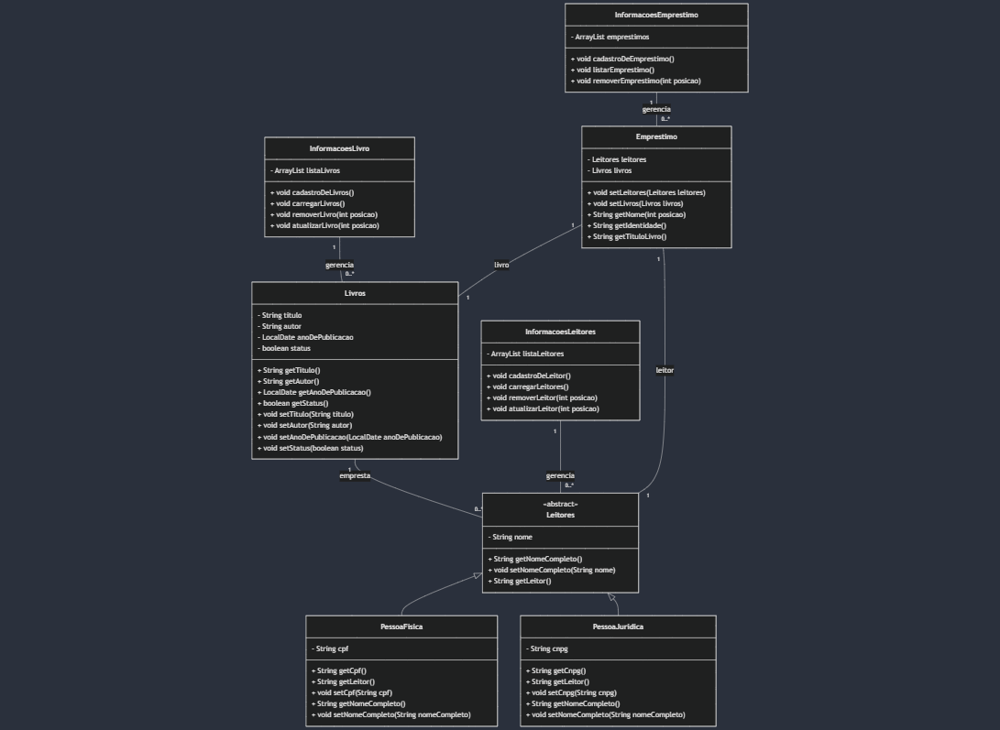

# Biblioteca: Sistema de Gerenciamento de Biblioteca

Este projeto foi desenvolvido como parte do trabalho da disciplina **Modelagem e Desenvolvimento Orientado a Objetos (Java)**, no **terceiro semestre** do curso de **Ciências da Computação**. O sistema implementa um gerenciamento eficiente de livros e leitores, proporcionando um controle organizado e funcional.

## 🚀 Funcionalidades do Sistema

### 📚 Gerenciamento de Livros
- **Cadastrar Livro:** Adicionar novos livros ao sistema.
- **Atualizar Livro:** Atualizar informações de livros cadastrados.
- **Remover Livro:** Excluir livros do sistema.
- **Listar Livros:** Listar todos os livros disponíveis.
- **Verificar Livro:** Verificar a disponibilidade de um livro.

### 👥 Gerenciamento de Leitores
- **Cadastrar Leitor:** Cadastrar leitores, incluindo pessoas físicas e jurídicas.
- **Atualizar Leitor:** Atualizar dados de leitores registrados.
- **Remover Leitor:** Excluir leitores do sistema.
- **Listar Leitores:** Exibir a lista de todos os leitores cadastrados.
  
### 📖 Gerenciamento de Empréstimos
- **Cadastro de Empréstimo:** Registrar o empréstimo de livros para leitores. O sistema permite que o leitor escolha um livro disponível e o empreste para um período determinado.
- **Remoção de Empréstimo:** Remover empréstimos registrados.
- **Listar Empréstimos:** Exibir a lista de todos os empréstimos realizados.

  ## 📂 Diagrama de Classe
Abaixo está o diagrama de classe do sistema:


  
## 🛠️ Tecnologias Utilizadas
- **Linguagem de Programação:** Java  
- **IDE:** Eclipse  
- **Paradigma:** Programação Orientada a Objetos  

## 📌 Como Executar
1. Clone o repositório:
   ```bash
   https://github.com/LucasOlimpio2314/Sistema-de-Biblioteca.git
   ```
2. Importe o projeto na IDE **Eclipse**.
3. Compile e execute a classe principal `Main`.

## 👨‍💻 Colaboradores
- **Lucas Barreto Olimpio** - R.A: 924100328  
- **Kelvin Felipe dos Santos** - R.A: 923200158  
- **Miguel Benites de Almeida** - R.A: 923209649  
- **Thiago Rocha Santana** - R.A: 923204332
- **Karen de Moraes Teixeira** - R.A: 924113300   
- **Lavínia Alves** - R.A: 924112295  
- **Viviane Souza** - R.A: 924105503  
- **Ana Lucia Soares de Oliveira** - R.A: 324101704  
- **Guilherme da Silva Ferreira** - R.A: 924111677
- **Lucas Souza Monção Silva** - R.A: 924111289

